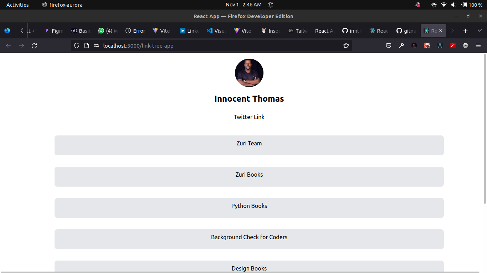

# HNG9 TASK 1 - BUILD BASIC WEBPAGE.

This is a simple webpage that displays user's profile.

This project was bootstrapped with [Create React App](https://github.com/facebook/create-react-app).

## The application was built using Javascript, React, Tailwind CSS

### live demo : [here](https://innthomas.github.io/link-tree-app/)

TASK DESCRIPTION
Create a page like Linktree that allows a person show their personal profile and link to various digital things that they sell. Details below.
Make frequent atomic commits to your GitHub repository and keep standard on commit messages.
The profile section
A profile picture with an id ‘profile__img’
Your twitter username with an id ‘twitter’
Your slack name with an id ‘slack’ - but this should be hidden (available in code, but cannot be seen)
The links section
A Link styles as a Button with an id ‘btn__zuri’ that redirects to “https://training.zuri.team/”
A Link styles as a Button with an id ‘books’ that redirects to http://books.zuri.team with the title and a subtext describing that this is where you find books about design and coding
A Link styles as a Button with an id ‘book__python’ that redirects to to https://books.zuri.team/python-for-beginners?ref_id=, where you feature the book as if you were selling it.The reference id must be unique and will give you royalties if any sales of the book come
A Link styles as a Button with an id ‘pitch’ that redirects to to https://background.zuri.team, where you pitch a service for doing background checks on coders. Use a good, selling sentence.
A Link styles as a Button with an id ‘book__design’ that redirects to to https://books.zuri.team/design-rules where you pitch the free design book offered by Zuri.